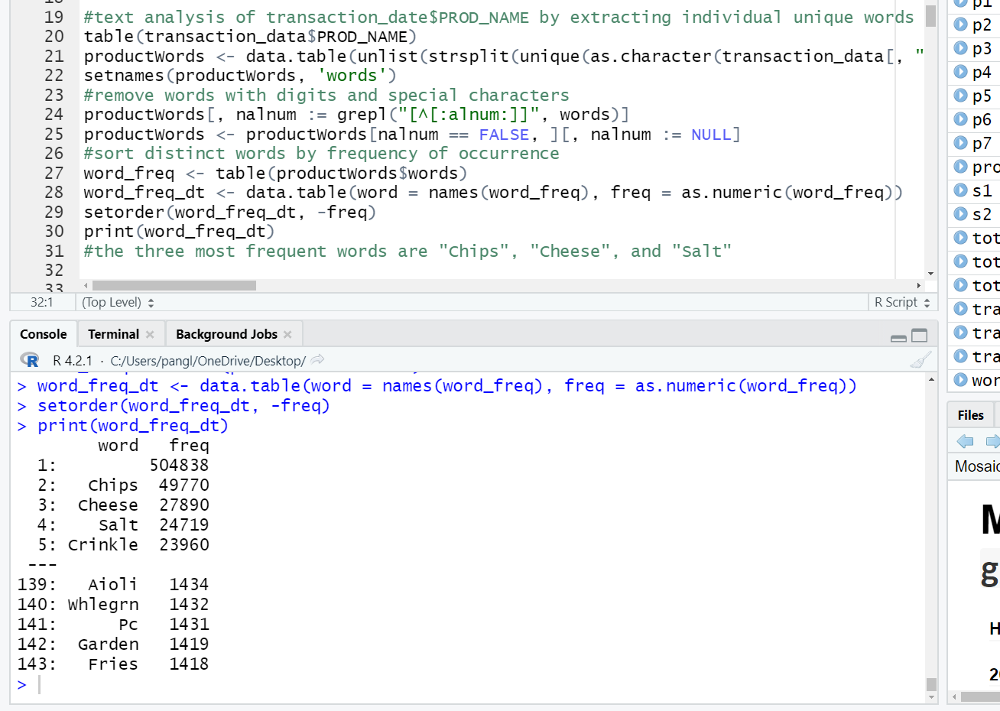
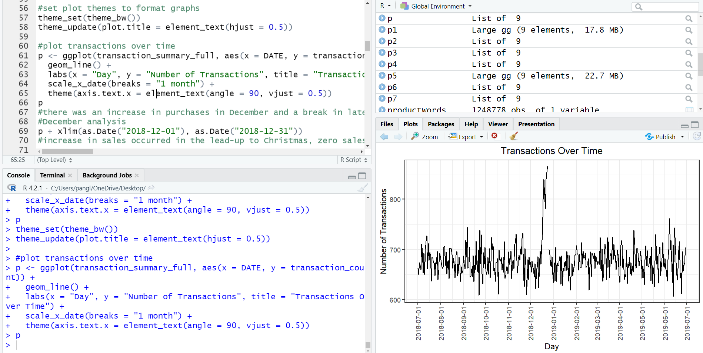
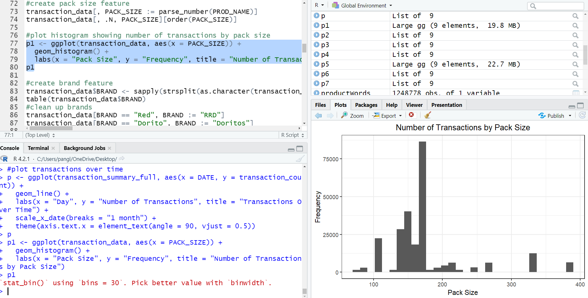
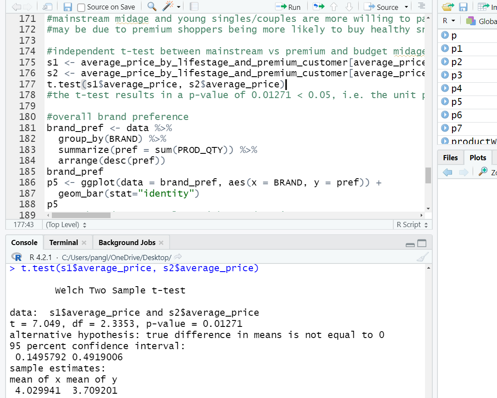
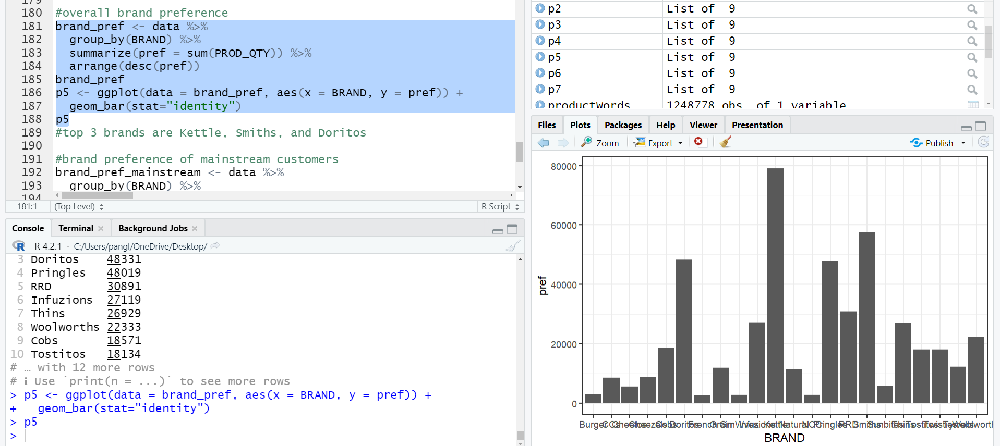

# Chips Preference Analysis

## Tools used: R

This is an R project on data preparation and customer analytics from Quantium's Data Analytics job simulation. Transaction and customer datasets were analysed to identify customer purchasing behaviours and generate insights on commercial recommendations.

Transaction data and customer data were checked for inconsistencies, missing data, outliers, and the accuracy of data types before being merged for further analysis. Metrics were defined and visualisations were created to identify interesting trends. Customer segments were analysed to determine the segments to be targeted in the next half year and beyond.

Screenshots are shown below.

## Word frequency analysis
 

## Plot of transactions over time
 

## Plot of transactions by pack size
 

## Independent t-test
 

## Overall brand preference
 

## Findings
* The number of daily transactions remained relatively stable at between 600 and 750 between July 2018 and July 2019, with a spike in December 2018 near to Christmas.
* The most frequently purchased pack sizes were between 140g and 170g.
* Sales came mainly from budget - older families, mainstream - young singles/couples, and mainstream - retirees.
* Generally, older families and young families bought more chips per customer.
* Mainstream mid-age and young singles/couples were more willing to pay more per packet of chips compared to their budget and premium counterparts. This may be due to premium shoppers being more likely to buy healthy snacks, and when they buy chips, it is mainly for entertainment purposes rather than their own consumption.
* The unit price for mainstream young and mid-age singles and couples were significantly higher than that of budget or premium young and mid-age singles/couples.
* The top 3 overall brands were Kettle, Smiths, and Doritos. Mainstream customers also preferred these 3 brands. As for young singles/couples, the top 3 brands were Kettle, Smiths, and Pringles.
